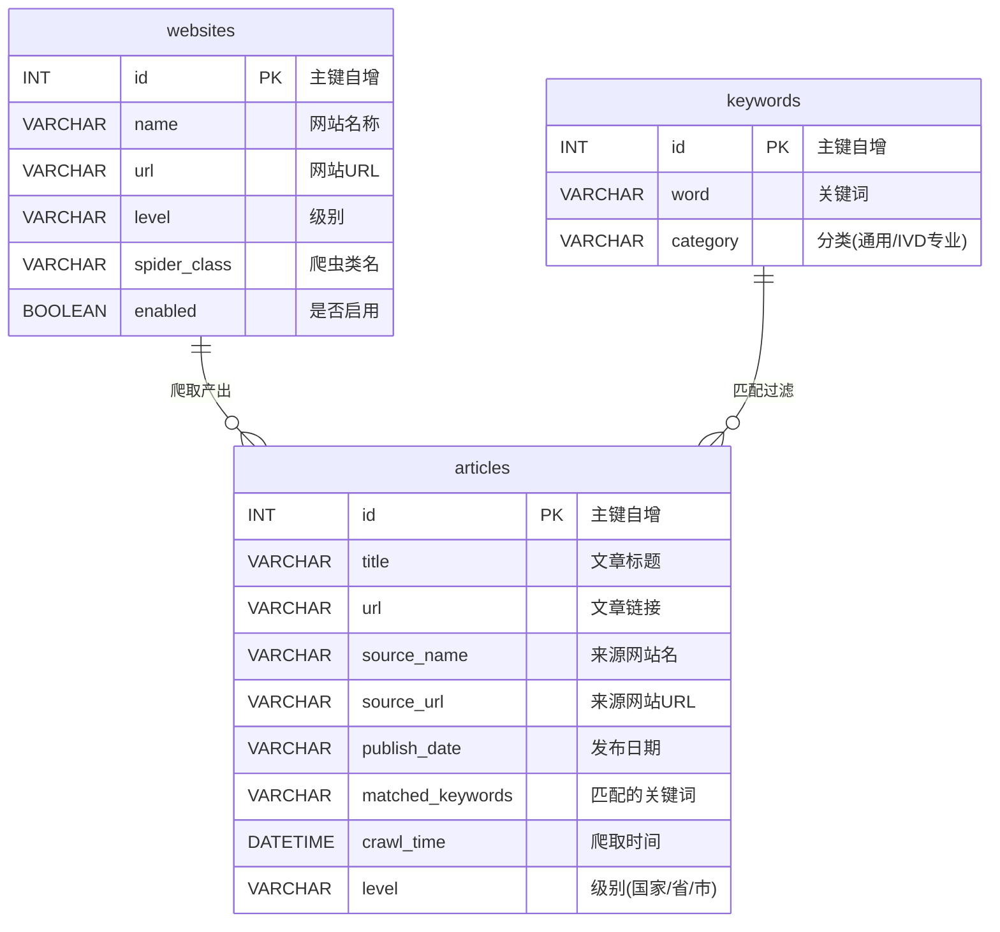

# 数据库 ER 图

本文档描述「政策信息监控系统」MySQL 数据库的实体关系。

## 1. 实体关系图

## 2. 表说明

### 2.1 articles 文章表

存储所有爬取到的政策文章。

| 字段 | 类型 | 约束 | 说明 |
| --- | --- | --- | --- |
| id | INT | PK, AUTO_INCREMENT | 主键 |
| title | VARCHAR(500) | NOT NULL | 文章标题 |
| url | VARCHAR(1000) | UNIQUE | 文章链接（去重依据） |
| source_name | VARCHAR(200) |  | 来源网站名 |
| source_url | VARCHAR(500) |  | 来源网站根 URL |
| publish_date | VARCHAR(50) |  | 发布日期（原始字符串） |
| matched_keywords | VARCHAR(500) |  | 命中的关键词，逗号分隔 |
| crawl_time | DATETIME | DEFAULT NOW | 爬取入库时间 |
| level | VARCHAR(20) |  | 国家 / 省 / 市 |

### 2.2 keywords 关键词表

存储用于过滤政策的关键词词库。

| 字段 | 类型 | 约束 | 说明 |
| --- | --- | --- | --- |
| id | INT | PK, AUTO_INCREMENT | 主键 |
| word | VARCHAR(100) | UNIQUE | 关键词 |
| category | VARCHAR(50) |  | 分类（通用 / IVD 专业） |

### 2.3 websites 网站配置表

存储所有目标爬取网站及其爬虫绑定关系。

| 字段 | 类型 | 约束 | 说明 |
| --- | --- | --- | --- |
| id | INT | PK, AUTO_INCREMENT | 主键 |
| name | VARCHAR(200) |  | 网站显示名 |
| url | VARCHAR(500) |  | 网站列表页 URL |
| level | VARCHAR(20) |  | 国家 / 省 / 市 |
| spider_class | VARCHAR(100) |  | 对应爬虫类名（national / sichuan / chengdu / gaoxintong） |
| enabled | BOOLEAN | DEFAULT TRUE | 是否启用 |

## 3. 关系说明

- **websites → articles（一对多）**：每个网站爬取后会产生多条文章记录，通过 `articles.source_url` 关联 `websites.url`。
- **keywords → articles（一对多）**：每条文章可能命中多个关键词，命中信息冗余存储在 `articles.matched_keywords` 中（逗号分隔）。
- **去重策略**：以 `articles.url` 作为唯一键，重复 URL 不会重复入库。
