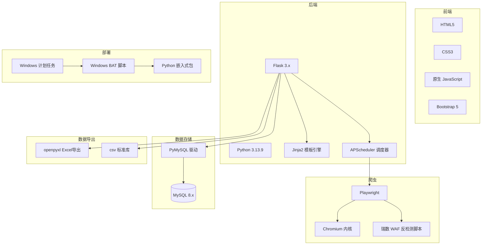

# 技术栈说明

本文档完整说明「公共事务部政策信息自动监控系统」所使用的技术栈、第三方依赖、部署方案。

## 1. 技术栈总览



## 2. 后端技术栈

| 类别 | 技术 | 版本 | 用途 |
| --- | --- | --- | --- |
| 语言 | Python | 3.13.9 | 主开发语言（嵌入式版本） |
| Web 框架 | Flask | 3.x | 轻量级 Web 服务，路由 + API |
| 模板引擎 | Jinja2 | 3.x | 渲染 HTML 模板 |
| 调度框架 | APScheduler | 3.x | 定时任务调度（每 4 小时爬取） |
| 多线程 | threading | 标准库 | 后台爬取，避免阻塞主线程 |

## 3. 前端技术栈

| 类别 | 技术 | 用途 |
| --- | --- | --- |
| 标记语言 | HTML5 | 页面结构 |
| 样式 | CSS3 + Bootstrap 5 | 响应式布局与现代 UI |
| 脚本 | 原生 JavaScript（ES6+） | 进度轮询、表单交互、AJAX |
| 异步通信 | Fetch API | 与 Flask API 通信 |

## 4. 爬虫技术栈

| 技术 | 用途 |
| --- | --- |
| **Playwright** | 替代 Selenium / Requests，提供更强反检测能力 |
| **Chromium 内核** | 通过 Playwright bundled 浏览器（680MB），支持 JS 渲染 |
| **反瑞数 WAF 脚本** | 注入 stealth 脚本绕过 `_RSData_`、`_$_` 等指纹检测 |
| **关键词匹配** | Python 字符串匹配，64 个关键词分通用 / IVD 专业两类 |

### 爬虫继承结构

```
BaseSpider（基类，封装 Playwright 启动 / 反检测 / 去重 / 入库）
├── NationalSpider     国家级（国务院 / 卫健委 / 药监局 / 医保局）
├── SichuanSpider      四川省级
├── ChengduSpider      成都市级
└── GaoxintongSpider   高新区
```

## 5. 数据存储

| 类别 | 技术 | 说明 |
| --- | --- | --- |
| 主数据库 | **MySQL 8.x** | 即将迁移目标（原为 SQLite） |
| Python 驱动 | PyMySQL | 纯 Python 实现，免编译 |
| ORM | 无 / 直连 SQL | 简单场景，使用游标 + 参数化 SQL |
| 表 | articles / keywords / websites | 见 [ER图.md](./ER图.md) |

## 6. 数据导出

| 格式 | 库 | 说明 |
| --- | --- | --- |
| Excel | openpyxl | 支持样式、公式、合并单元格 |
| CSV | csv（标准库） | UTF-8 BOM，避免 Excel 中文乱码 |

输出目录：`output/政策监控_YYYYMMDD_HHMMSS.xlsx`

## 7. 部署方案

| 项 | 说明 |
| --- | --- |
| **Python 运行时** | 嵌入式 Python 3.13.9，免安装，位于 `python/` 目录 |
| **浏览器** | Playwright Chromium，bundled 在 `python/Lib/site-packages/playwright/driver/package/.local-browsers` |
| **环境变量** | `PLAYWRIGHT_BROWSERS_PATH=0`，使用 bundled 浏览器 |
| **EXE 启动器（推荐）** | `政策监控工具.exe`（约 7.8MB，PyInstaller 打包自 `launcher.py`），双击即启动服务并自动打开浏览器，需与 `python\` 目录、`app.py` 保持同层级 |
| **启动方式** | `start.bat` 一键启动 Flask（端口 5000） |
| **停止方式** | `stop.bat` 通过端口 5000 杀进程 |
| **立即爬取** | `crawl_now.bat` 命令行触发一次全量 |
| **服务器部署** | `deploy_server.bat` 配置 Windows 计划任务（schtasks）开机自启 |
| **目标 OS** | Windows Server 2016+ / Windows 10+ |

## 8. 第三方依赖列表（requirements.txt）

| 包名 | 用途 |
| --- | --- |
| Flask | Web 框架 |
| Jinja2 | 模板引擎（Flask 自带） |
| APScheduler | 定时任务 |
| playwright | 浏览器自动化 |
| PyMySQL | MySQL 驱动 |
| **cryptography** | **MySQL 8.0 caching_sha2_password 认证支持（v44.0.3）** |
| openpyxl | Excel 导出 |
| python-dotenv | 环境变量管理 |
| requests | HTTP 请求（部分简单页面） |
| beautifulsoup4 | HTML 解析（辅助） |
| lxml | XML/HTML 解析器 |

## 9. 目录结构

```
paqu/
├── app.py              Flask 入口
├── config.py           配置（关键词、网站、数据库连接）
├── database.py         数据访问层
├── scheduler.py        定时调度
├── crawl_export.py     爬取与导出主流程
├── spiders/            爬虫模块（base + 4个子类）
├── templates/          Jinja2 模板
├── static/             静态资源（CSS/JS）
├── data/               SQLite 历史数据（迁移前）
├── output/             导出文件
├── docs/               技术文档（本目录）
├── python/             嵌入式 Python 运行时（680MB）
├── *.bat               一键脚本
└── requirements.txt    依赖清单
```
