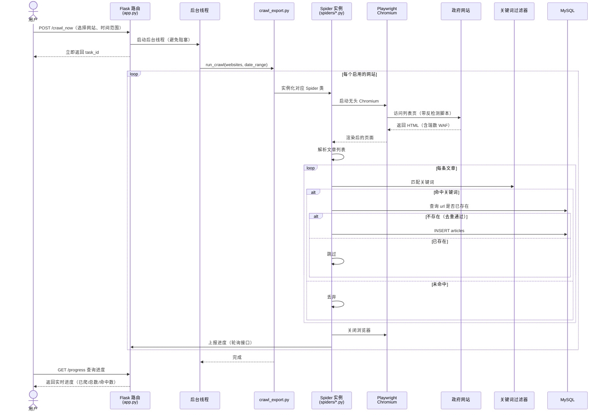
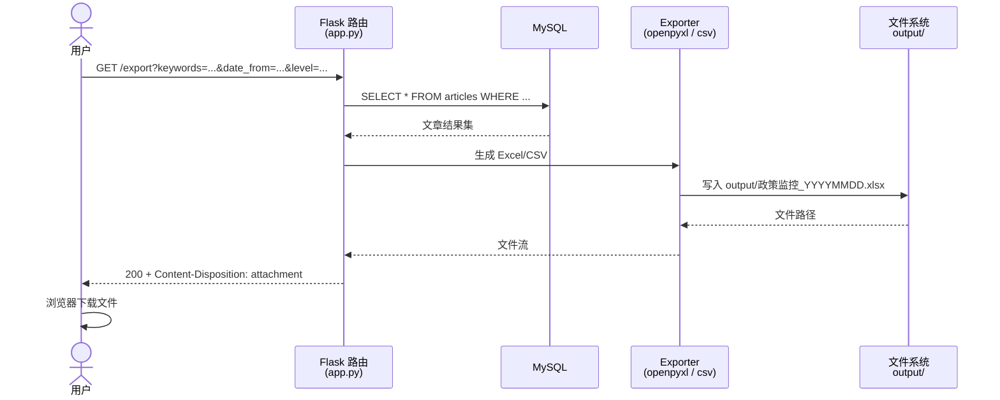
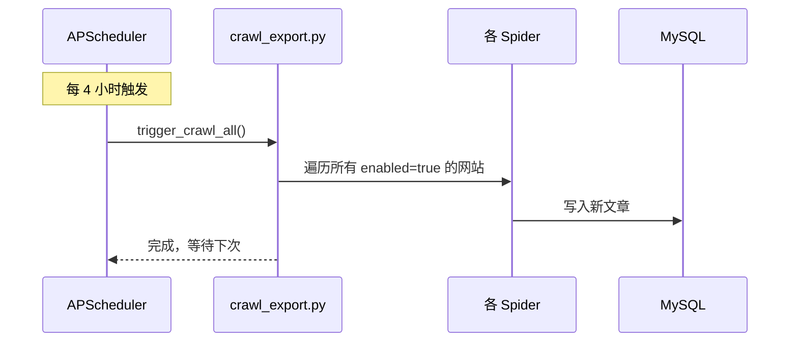

# 核心流程时序图

本文档描述系统两大核心流程的时序交互：**爬取流程** 与 **导出流程**。

## 1. 爬取流程时序图

涵盖从用户在 Web 界面点击「立即爬取」到结果写入数据库的完整链路。

## 2. 导出流程时序图

用户在结果页筛选后点击导出，生成 Excel/CSV 文件下载。

## 3. 定时调度时序图（补充）

APScheduler 每 4 小时自动触发一次完整爬取。

## 4. 流程要点

| 流程 | 关键点 |
| --- | --- |
| 爬取 | 后台线程异步执行，避免阻塞 Flask 主线程；通过轮询 `/progress` 实现实时进度 |
| 反爬 | Playwright 注入反检测脚本绕过瑞数 WAF |
| 去重 | 以 `articles.url` 作为唯一键，数据库层面拦截重复 |
| 导出 | 支持按关键词、日期、级别筛选；生成文件保存到 `output/` 目录 |
| 调度 | APScheduler 每 4 小时自动跑一次全量；用户可随时手动触发 |
