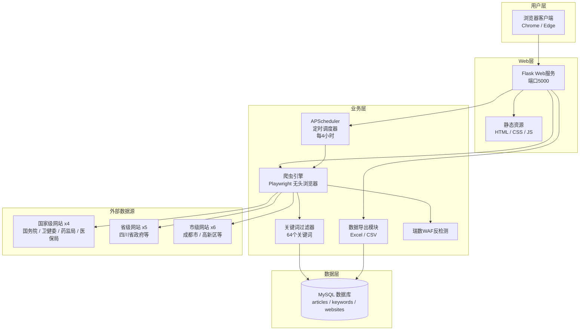
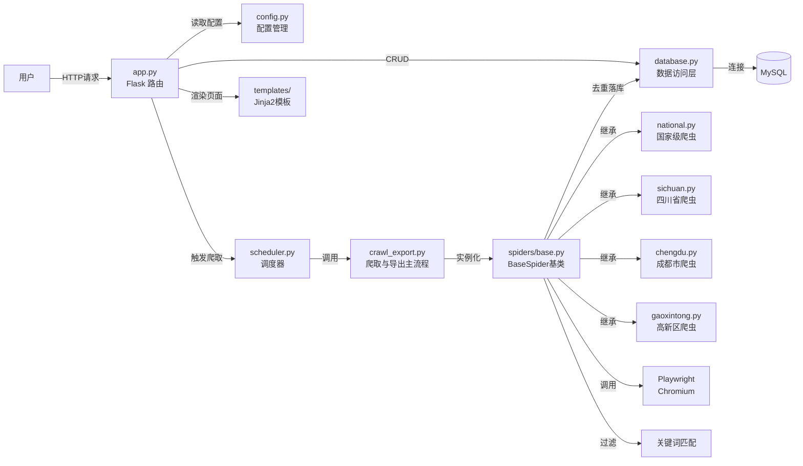

# 系统架构图

本文档描述「公共事务部政策信息自动监控系统」的整体架构与组件关系。

## 1. 整体系统架构（分层视图）

系统采用经典分层架构，自顶向下分为：用户层、Web 层、业务层、数据层、外部数据源。

## 2. 组件关系图

展示各核心模块之间的调用、依赖与数据流向。

## 3. 架构说明

| 层级 | 组件 | 职责 |
| --- | --- | --- |
| 用户层 | 浏览器 | 操作 Web 管理界面，查看进度、结果与导出 |
| Web 层 | Flask + 模板 | 提供路由、渲染、API 接口 |
| 业务层 | 调度器 / 爬虫引擎 / 过滤器 / 导出器 | 实现自动爬取、去重、过滤、导出 |
| 数据层 | MySQL | 持久化文章、关键词、网站配置 |
| 外部数据源 | 15 个政府站点 | 国家级 4 个、省级 5 个、市级 6 个 |
