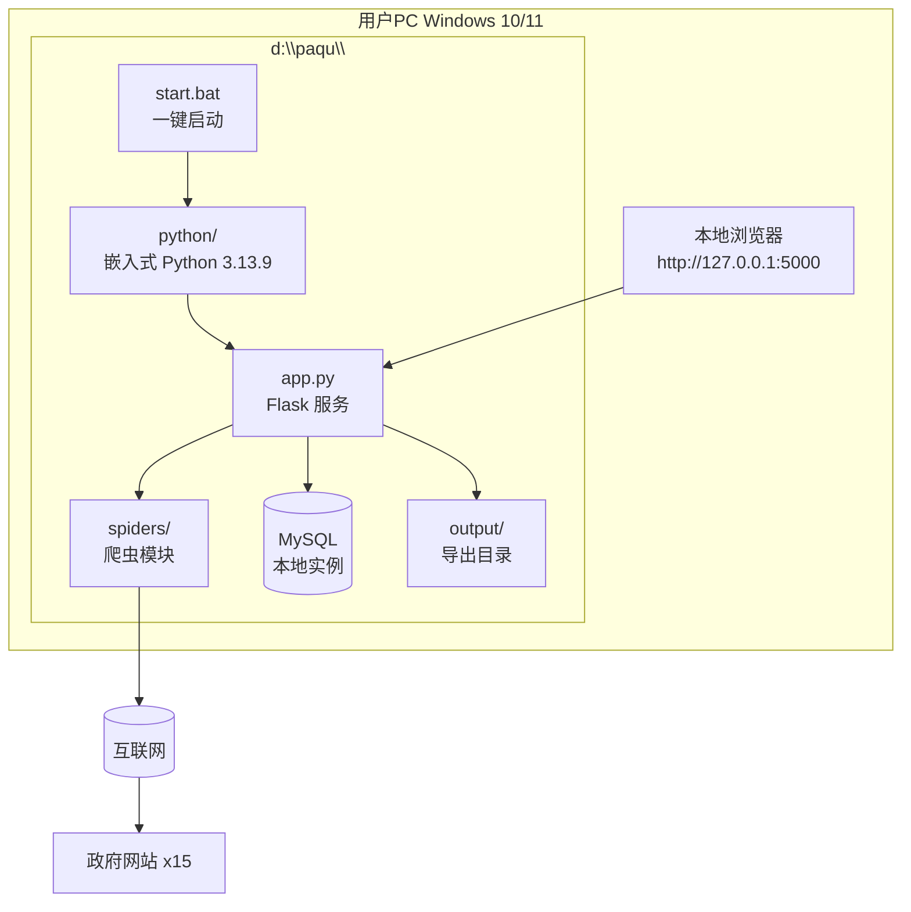
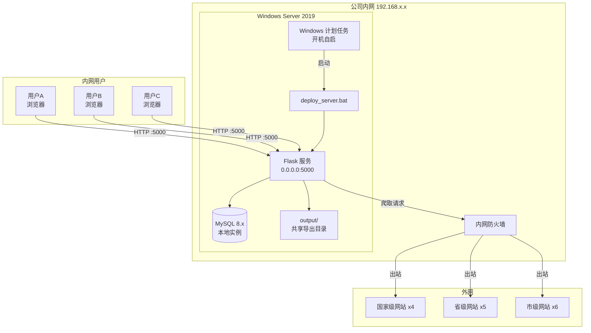
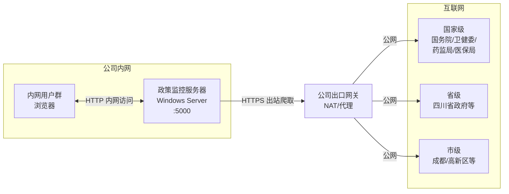

# 部署架构图

本文档描述「政策信息监控系统」的两种部署模式与网络拓扑。

## 1. 本地部署模式（开发 / 单机使用）

适用于公共事务部内部用户在 Windows 个人电脑上一键运行。

### 部署步骤

1. 解压项目压缩包到 `d:\paqu\`
2. 双击 `install.bat` 初始化数据库
3. 双击 `start.bat` 启动服务
4. 浏览器访问 `http://127.0.0.1:5000`

## 2. 服务器部署模式（生产）

部署到 Windows Server，供公共事务部多人通过内网访问。

### 部署步骤

1. 将完整项目目录（含 `python/`）复制到服务器 `D:\paqu\`
2. 在 MySQL 中创建数据库：`CREATE DATABASE paqu CHARACTER SET utf8mb4;`
3. 修改 `config.py` 中数据库连接信息
4. 以管理员身份运行 `deploy_server.bat`：
   - 注册 Windows 计划任务（开机启动）
   - 立即启动一次 Flask 服务
5. 配置防火墙允许入站 5000 端口
6. 内网用户访问 `http://<服务器IP>:5000`

## 3. 网络拓扑图

## 4. 部署模式对比

| 维度 | 本地部署 | 服务器部署 |
| --- | --- | --- |
| 适用场景 | 个人调试、小范围使用 | 部门共享、生产环境 |
| 启动方式 | 双击 `start.bat` | `deploy_server.bat` + 计划任务 |
| 监听地址 | `127.0.0.1:5000` | `0.0.0.0:5000` |
| 访问方式 | 仅本机浏览器 | 内网任意机器浏览器 |
| 数据库 | 本机 MySQL | 服务器本地 MySQL |
| 自启 | 无 | Windows 计划任务，开机启动 |
| 高可用 | 无 | 计划任务自动重启（可选） |

## 5. 关键运维要点

| 项 | 说明 |
| --- | --- |
| **端口** | Flask 监听 5000；MySQL 监听 3306（仅本机） |
| **环境变量** | `PLAYWRIGHT_BROWSERS_PATH=0` 必须设置 |
| **磁盘占用** | 嵌入式 Python ~680MB；MySQL 数据 < 1GB（一年量） |
| **网络要求** | 服务器需可访问 15 个政府网站（HTTPS 出站） |
| **防火墙** | 入站 5000 仅对内网开放；禁止公网暴露 |
| **日志** | Flask 日志输出至控制台；可重定向到 `logs/app.log` |
| **备份** | 定期备份 MySQL `paqu` 数据库与 `output/` 目录 |
